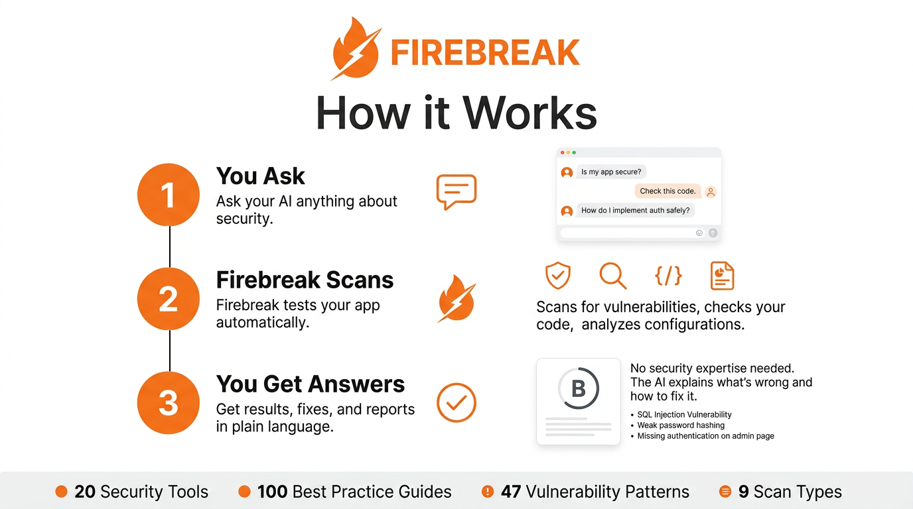

<p align="center">
  
  <br><br>
  <strong>The security MCP server that turns your AI into a penetration tester.</strong>
  <br>
  <p align="center">
    <a href="#quick-start">Quick Start</a> &middot;
    <a href="#how-it-works">How It Works</a> &middot;
    <a href="#tool-reference">Tool Reference</a> &middot;
    <a href="#contributing">Contributing</a> &middot;
    <a href="#license">License</a>
  </p>
  <p align="center">
    <a href="https://github.com/protonese3/Firebreak/actions"></a>
    <a href="https://github.com/protonese3/Firebreak/blob/master/LICENSE"></a>
    
    
  </p>
</p>

---

Connect Firebreak to Claude, Cursor, or any MCP-compatible client. Then just ask:

```
You:    "Is my app secure?"
Claude: [calls firebreak tools] Found 6 vulnerabilities. 1 high (CORS misconfiguration),
        5 medium (missing security headers). Security score: B. Want me to fix them?
```

No CLI to learn. No reports to read. The AI runs the scans, interprets the results, and walks you through the fixes.

---

## Why Firebreak

AI-generated code ships with predictable vulnerabilities: inconsistent auth middleware, permissive RLS policies, IDOR on every endpoint, secrets in the JS bundle. Developers who use AI to build don't always know how to test what it builds.

Firebreak flips the problem. Instead of expecting developers to learn security tooling, it gives the AI the security tooling. The same AI that wrote the code can now test it, find the holes, and fix them.

**What makes it different:**

- **MCP-native** — not a CLI wrapper. Built from the ground up for AI tool calling.
- **VCVD** — 40 vulnerability patterns specific to AI-generated code that traditional scanners miss.
- **Proof over theory** — every finding includes the actual HTTP request/response that proves the vulnerability.
- **Safe by design** — rate limited, scope-locked, non-destructive. Can't accidentally DROP your database.

---

## Quick Start

### Option 1: Build from source

```bash
git clone https://github.com/protonese3/Firebreak.git
cd Firebreak
cargo build --release
./target/release/firebreak
```

### Option 2: Docker

```bash
git clone https://github.com/protonese3/Firebreak.git
cd Firebreak
docker compose up -d
```

Either way, Firebreak starts on port **9090**.

### Connect to Claude Desktop

Add this to your `claude_desktop_config.json`:

```json
{
  "mcpServers": {
    "firebreak": {
      "url": "http://localhost:9090/mcp"
    }
  }
}
```

Restart Claude Desktop. You now have 20 security tools available.

### Connect to Cursor / Windsurf / Any MCP Client

Point your client's MCP configuration to `http://localhost:9090/mcp`. The server speaks standard MCP (JSON-RPC 2.0 over HTTP).

### Verify it works

Ask your AI: *"What security tools do you have available?"*

It should list the Firebreak tools. Then try: *"Scan https://httpbin.org for security issues"*

---

## How It Works

<p align="center">
  
</p>

**The AI is the orchestrator.** Firebreak doesn't decide what to test — it provides the tools. The AI picks the strategy based on what the user asks and what it finds along the way.

### Typical flow

```
1. User: "Test my app at https://myapp.com"

2. AI calls firebreak_scan_quick({ target_url: "https://myapp.com" })
   └── Firebreak probes headers, paths, CORS, TLS
   └── Returns: 4 findings, score B

3. AI explains results in plain language
   └── "Found a CORS misconfiguration and 3 missing headers..."

4. User: "Fix the CORS issue"

5. AI calls firebreak_finding_fix({ finding_id: "...", framework: "express" })
   └── Returns: before/after code diff for Express

6. User applies fix

7. AI calls firebreak_replay({ finding_id: "..." })
   └── Returns: "Fixed. Server no longer reflects arbitrary origins."
```

---

## Tool Reference

### Knowledge Tools

These don't hit any external service. They query Firebreak's built-in security knowledge base.

| Tool | Description | Example |
|------|-------------|---------|
| `firebreak_best_practice` | Security best practices for a topic | `{ topic: "jwt-auth" }` |
| `firebreak_check_pattern` | Scan code for insecure patterns | `{ code: "...", language: "javascript" }` |
| `firebreak_explain_vuln` | Explain a vulnerability type | `{ vuln_id: "IDOR" }` |
| `firebreak_security_checklist` | Generate a security checklist | `{ stack: ["nextjs", "supabase"] }` |
| `firebreak_owasp_check` | Map a finding to OWASP Top 10 | `{ description: "SQL injection in login" }` |
| `firebreak_analyze_rls` | Analyze SQL for RLS policy issues | `{ sql: "CREATE POLICY..." }` |

### Scan Tools

These make HTTP requests to the target. Rate limited and scope-locked.

| Tool | Description | Example |
|------|-------------|---------|
| `firebreak_scan_quick` | Fast scan, critical+high only (2-3 min) | `{ target_url: "https://myapp.com" }` |
| `firebreak_scan_full` | Full pen test (black/gray/white box) | `{ target_url: "...", mode: "gray", credentials: [...] }` |
| `firebreak_scan_target` | Focused scan on one area | `{ target_url: "...", focus: "auth" }` |
| `firebreak_scan_status` | Check progress of a running scan | `{ scan_id: "..." }` |
| `firebreak_scan_stop` | Stop a scan, keep partial results | `{ scan_id: "..." }` |

### Analysis Tools

These work with stored scan results. No external requests.

| Tool | Description |
|------|-------------|
| `firebreak_results` | Scan summary with security score (A-F) |
| `firebreak_finding_detail` | Full evidence for a specific finding |
| `firebreak_finding_fix` | Generate fix code for a finding |
| `firebreak_replay` | Re-test a finding to verify it's fixed |
| `firebreak_compare` | Diff two scans (fixed / new / unchanged) |
| `firebreak_scan_history` | List previous scans for a target |
| `firebreak_attack_chain` | Multi-step attack chains |
| `firebreak_report_generate` | Export report (JSON, Markdown, HTML) |
| `firebreak_report_executive` | Non-technical executive summary |

---

## VCVD — Vibe Coding Vulnerability Database

40 vulnerability patterns that AI-generated code gets wrong. Traditional scanners don't look for these because they're specific to how LLMs write code.

### Auth & Identity

| ID | Pattern | Severity |
|----|---------|----------|
| VC-AUTH-001 | Inconsistent auth middleware — AI applies auth to some routes but not others | CRITICAL |
| VC-AUTH-002 | Client-only validation — role checks exist in React but not in the API | CRITICAL |
| VC-AUTH-003 | JWT decoded without verification — `jwt.decode()` instead of `jwt.verify()` | CRITICAL |
| VC-AUTH-004 | Service key in client code — Supabase `service_role` key in the JS bundle | CRITICAL |
| VC-AUTH-005 | Token expiry >30 days — "for convenience" | HIGH |
| VC-AUTH-006 | OAuth without state parameter | HIGH |
| VC-AUTH-007 | Password in URL query string | HIGH |
| VC-AUTH-008 | Session not regenerated after login | MEDIUM |

### Data Access

| ID | Pattern | Severity |
|----|---------|----------|
| VC-DATA-001 | IDOR — sequential IDs without ownership check | CRITICAL |
| VC-DATA-002 | `USING (true)` in RLS — AI's "temporary" policy that ships to prod | CRITICAL |
| VC-DATA-003 | Table created without enabling RLS | CRITICAL |
| VC-DATA-004 | `SELECT *` exposing password hashes and PII | HIGH |
| VC-DATA-005 | `...req.body` spread into DB insert without field whitelist | HIGH |
| VC-DATA-006 | GraphQL introspection enabled in production | MEDIUM |
| VC-DATA-007 | Unbounded N+1 queries as DoS vector | MEDIUM |
| VC-DATA-008 | Multi-tenant queries missing `tenant_id` filter | CRITICAL |

### Injection

| ID | Pattern | Severity |
|----|---------|----------|
| VC-INJ-001 | Template literals in SQL queries | CRITICAL |
| VC-INJ-002 | `innerHTML` with user input | HIGH |
| VC-INJ-003 | User content stored and rendered without sanitization | CRITICAL |
| VC-INJ-004 | User input in `exec()` / `spawn()` | CRITICAL |
| VC-INJ-005 | File paths built from user input | HIGH |
| VC-INJ-006 | Server-side fetch with user-provided URL (SSRF) | HIGH |
| VC-INJ-007 | User input passed as template source | HIGH |
| VC-INJ-008 | MongoDB operators in JSON input | HIGH |

### Infrastructure

| ID | Pattern | Severity |
|----|---------|----------|
| VC-INFRA-001 | Debug mode / stack traces in production | HIGH |
| VC-INFRA-002 | `Access-Control-Allow-Origin: *` with credentials | HIGH |
| VC-INFRA-003 | Missing HSTS, X-Frame-Options, CSP | MEDIUM |
| VC-INFRA-004 | Unnecessary Docker ports exposed | MEDIUM |
| VC-INFRA-005 | User uploads stored without encryption | MEDIUM |
| VC-INFRA-006 | TLS 1.0/1.1 still enabled | MEDIUM |
| VC-INFRA-007 | Admin panel accessible from public internet | HIGH |
| VC-INFRA-008 | Default credentials unchanged | CRITICAL |

### Frontend

| ID | Pattern | Severity |
|----|---------|----------|
| VC-FE-001 | API keys in JavaScript bundle | CRITICAL |
| VC-FE-002 | Auth guard only in React Router, not in API | HIGH |
| VC-FE-003 | JWT stored in `localStorage` | MEDIUM |
| VC-FE-004 | Forms without CSRF protection | HIGH |
| VC-FE-005 | Redirect URL from query param without validation | MEDIUM |
| VC-FE-006 | `postMessage` handler without origin check | MEDIUM |
| VC-FE-007 | Source maps accessible in production | LOW |
| VC-FE-008 | Sensitive fields without `autocomplete="off"` | LOW |

---

## Security Scoring

Every scan produces a letter grade based on what was found:

| Grade | Criteria | Interpretation |
|-------|----------|----------------|
| **A** | Zero critical or high. Max 2 medium. | Ship it. |
| **B** | Zero critical. Some high or medium. | Fix the highs soon. |
| **C** | Multiple high severity issues. | Needs work before production. |
| **D** | 1-2 critical or >5 high. | Significant risk. Prioritize fixes. |
| **F** | 3+ critical or a full compromise chain. | Do not deploy. |

---

## Safety Guardrails

Firebreak is designed for authorized testing only.

| Guardrail | How it works |
|-----------|-------------|
| **Rate limiting** | 10 requests/second to the target (configurable). Sliding window. |
| **Scope lock** | Only attacks the specified target URL. No lateral movement, no subdomain enumeration. |
| **Non-destructive** | No DELETE, DROP, UPDATE, or POST requests that modify data. Probing only. |
| **Consent** | The AI asks for confirmation before the first scan. |
| **Audit trail** | Every HTTP request is logged with timestamp, target, and reason. |

---

## Configuration

Environment variables:

| Variable | Default | Description |
|----------|---------|-------------|
| `FIREBREAK_HOST` | `0.0.0.0` | Bind address |
| `FIREBREAK_PORT` | `9090` | Port |
| `RUST_LOG` | `firebreak=info` | Log level |

Copy `.env.example` to `.env` and edit as needed.

---

## Project Structure

```
firebreak/
├── src/
│   ├── main.rs                 # Axum HTTP server, AppState, routing
│   ├── types.rs                # Shared types: Scan, Finding, Evidence, ScanSummary
│   │
│   ├── mcp/                    # MCP protocol implementation
│   │   ├── protocol.rs         #   JSON-RPC 2.0 types
│   │   └── handler.rs          #   Request dispatch (initialize, tools/list, tools/call)
│   │
│   ├── tools/                  # MCP tool implementations
│   │   ├── knowledge/          #   Knowledge tools (best practices, pattern check, OWASP)
│   │   ├── scan.rs             #   Scan tools (quick, full, targeted, status, stop)
│   │   └── analysis.rs         #   Analysis tools (results, fix, replay, compare, reports)
│   │
│   ├── engine/                 # HTTP scanning engine
│   │   ├── mod.rs              #   Scan orchestration (quick/full/targeted/replay)
│   │   └── checks.rs           #   9 check types (headers, CORS, auth, IDOR, injection...)
│   │
│   ├── vcvd/                   # Vibe Coding Vulnerability Database
│   │   └── data.rs             #   40 patterns with descriptions, detection, fixes
│   │
│   ├── store/                  # SQLite persistence
│   │   └── mod.rs              #   CRUD for scans, findings, audit log
│   │
│   ├── safety/                 # Safety guardrails
│   │   └── mod.rs              #   Rate limiter, scope lock, consent, audit trail
│   │
│   ├── rls/                    # RLS policy analyzer
│   │   └── mod.rs              #   SQL parsing with sqlparser-rs
│   │
│   └── report/                 # Report generation
│       └── mod.rs              #   JSON, Markdown, HTML, executive summary
│
├── knowledge/
│   └── best-practices/         # 7 security guides (JWT, RLS, CORS, uploads...)
│
├── frontend/                   # React dashboard (Vite + TypeScript + Tailwind)
│
├── Dockerfile                  # Multi-stage build, non-root user
├── docker-compose.yml          # Firebreak + headless Chromium
└── .github/workflows/ci.yml   # Build, test, lint, artifacts
```

---

## Tech Stack

| Component | Technology | Why |
|-----------|-----------|-----|
| Language | Rust | Single binary, no runtime, memory safe, fast |
| HTTP server | Axum | Async, tower middleware ecosystem |
| HTTP client | reqwest | Mature, TLS support, redirect control |
| Database | SQLite (rusqlite) | Zero setup, embedded, good enough for local scans |
| SQL parser | sqlparser-rs | RLS policy analysis without a running database |
| Async runtime | tokio | Industry standard |
| Serialization | serde + serde_json | Fast, derive macros |
| Dashboard | React + TypeScript + Vite + Tailwind | Modern, fast dev server, utility CSS |

The release binary is ~8 MB with no runtime dependencies.

---

## Contributing

Contributions are welcome. Here's how to get involved:

### Getting started

```bash
git clone https://github.com/protonese3/Firebreak.git
cd Firebreak
cargo build
cargo test
```

The server runs on `http://localhost:9090/mcp` by default.

### Areas where help is needed

**New VCVD patterns** — Found a vulnerability pattern that AI consistently generates? Add it to `src/vcvd/data.rs`. Each pattern needs an ID, description, severity, detection hint, and fix.

**Scan engine checks** — Add new vulnerability checks in `src/engine/checks.rs`. Each check function takes a reqwest client, target URL, and safety reference. Return a `Vec<Finding>`.

**Best practice guides** — Add markdown files to `knowledge/best-practices/`. Then register them in `src/tools/knowledge/best_practices.rs`.

**Framework-specific fixes** — The `finding_fix` tool generates fix code. Add framework support in `src/tools/analysis.rs` in the `framework_fix_example` function.

**Dashboard** — The React frontend lives in `frontend/`. Run `npm run dev` for the dev server.

### Submitting changes

1. Fork the repo
2. Create a branch (`git checkout -b add-new-check`)
3. Make your changes
4. Run `cargo check && cargo clippy -- -D warnings`
5. Open a pull request with a clear description of what you changed and why

### Code style

- No unnecessary comments. If the code says what it does, don't add a comment.
- Guard clauses over nested if/else.
- Match the style of existing code.
- Every finding must have verifiable evidence — no "this might be vulnerable."

### Reporting security issues

If you find a security vulnerability in Firebreak itself, please email **security@firebreak.dev** instead of opening a public issue. We'll respond within 48 hours.

---

## Roadmap

### Done

- [x] MCP server with JSON-RPC 2.0 over HTTP
- [x] 20 MCP tools (knowledge, scan, analysis, report)
- [x] VCVD v1 — 40 vulnerability patterns
- [x] HTTP scanning engine with 9 check types
- [x] SQLite persistence
- [x] Safety guardrails
- [x] Report generation (JSON, Markdown, HTML)
- [x] RLS policy analyzer (sqlparser-rs)
- [x] Docker support
- [x] CI/CD pipeline

### Next

- [ ] Web dashboard (React)
- [ ] Gray-box scanning with authenticated sessions
- [ ] Headless browser for frontend-rendered apps
- [ ] Scheduled / recurring scans
- [ ] Webhook notifications (Slack, Discord)
- [ ] PDF report export
- [ ] Cloud-hosted option (managed VPS)
- [ ] Plugin system for custom checks
- [ ] VCVD community contributions via PR

---

## FAQ

**Do I need to be a security expert to use this?**
No. That's the point. The AI handles the security expertise. You just tell it what to test.

**What MCP clients work with Firebreak?**
Any client that supports MCP over HTTP: Claude Desktop, Claude Code, Cursor, Windsurf, and others.

**Is it safe to run against production?**
Firebreak is non-destructive (read-only probing), but you should always test against staging first. Rate limiting is on by default.

**Can I add my own vulnerability checks?**
Yes. Add check functions in `src/engine/checks.rs` and wire them into the scan methods in `src/engine/mod.rs`.

**Why Rust?**
Single binary with no runtime dependencies. Fast. Memory safe. We ship one file and it works.

**Why AGPL-3.0?**
If you run Firebreak as a service for others, you must share your modifications. If you use it internally or self-host for your own team, you don't need to do anything special.

---

## License

[AGPL-3.0](LICENSE)

If you build a commercial service on top of Firebreak, the AGPL requires you to open-source your modifications. For internal and self-hosted use, no restrictions beyond the standard AGPL terms.

---

<p align="center">
  <strong>FIREBREAK</strong> — Because if you don't test it, someone else will.
</p>
